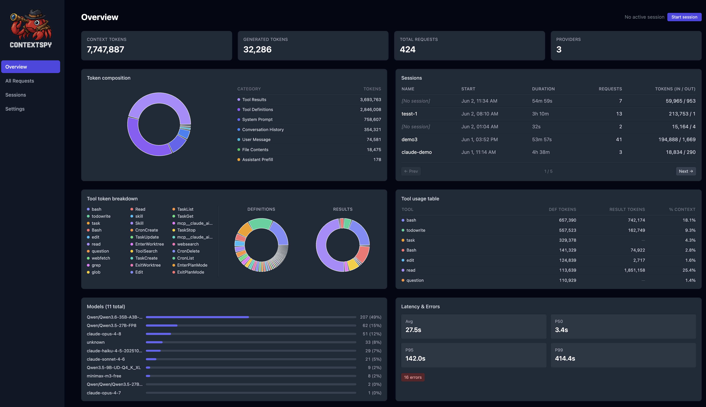
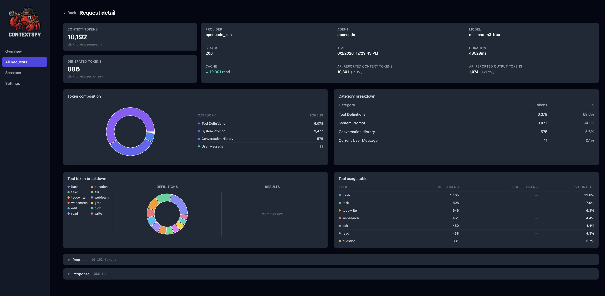
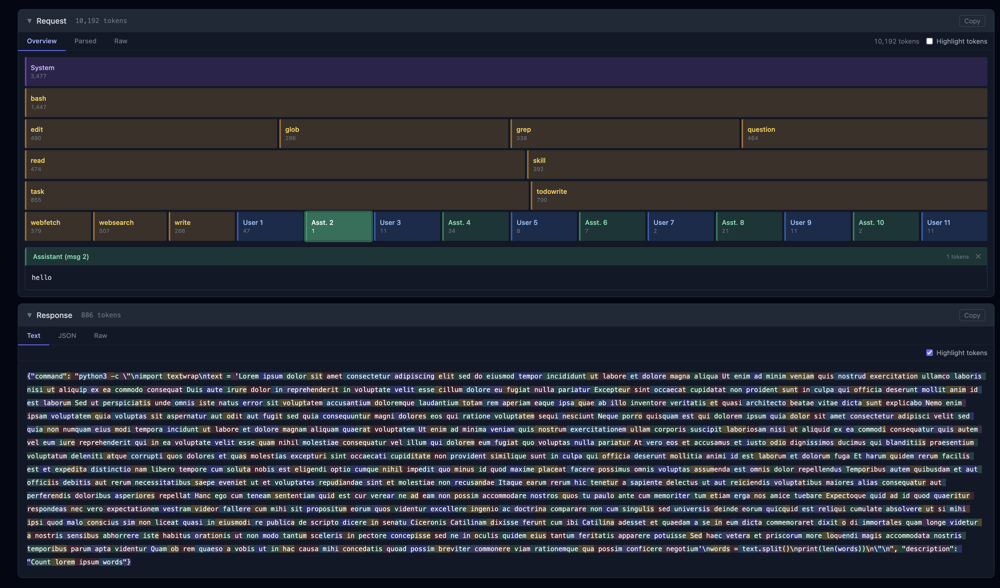
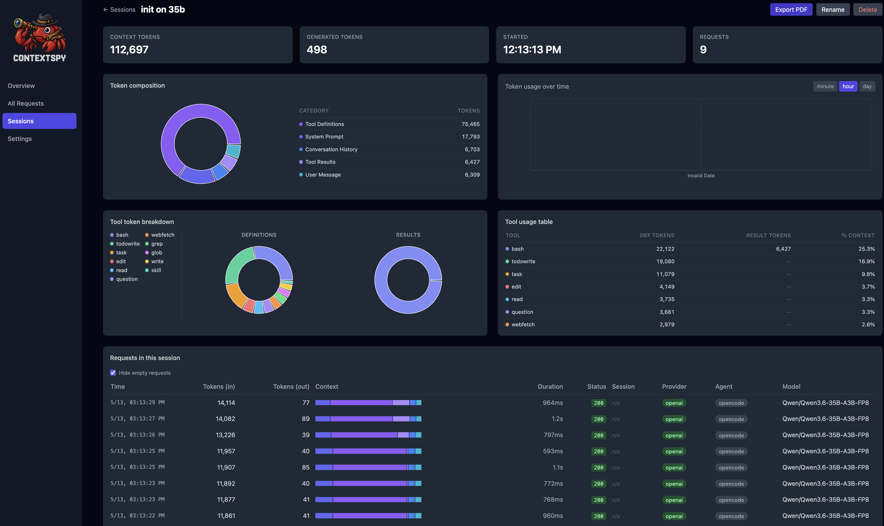

<div align="center" id="contextspytop">
</img>

[](https://pypi.org/project/contextspy)

[](https://github.com/RimantasZ/contextspy/tree/main/LICENSE)
[](https://github.com/RimantasZ/contextspy/issues)
[](https://github.com/RimantasZ/contextspy/issues)

</div>

--------------------------------------------------------------------------------
<p align="center">
<a href="#quick-start"><b>Quick start</b></a> |
<a href="#why-should-i-care"><b>Motivation</b></a> |
<a href="docs/changelog.md"><b>What's new</b></a> |
<a href="docs/install.md"><b>Install guide</b></a> |
<a href="docs/cloud-mode.md"><b>Coding agent setup</b></a> |
<a href="docs/faq.md"><b>FAQ</b></a> |
<a href="docs/confirmed.md"><b>Supported agents</b></a> 
</p>

ContextSpy is a context window profiler for large language models and common agentic AI coding tools.
It is used to intercept requests to an LLM API, analyze and visualize prompt composition, and track context 
changes between multiple requests in the same session. Modern AI coding agents (GitHub Copilot, Claude Code, opencode, etc.) pack a lot into each LLM request: system prompts, tool definitions and results, file contents, conversation history. It's often unclear why a session is slow, expensive, or hitting
the context limit. ContextSpy makes the invisible visible - you see a live breakdown of
every token category for every request, across sessions, over time.

<p align="center"><strong>Example dashboard view</strong><br></p>

Think of your favorite CPU or memory profiler, just applied to the contents of the context of an AI agent. While you can optimize performance just by reviewing code, having a profiler to capture and visualise snapshot data helps a lot. Same with LLM context optimisation.

## Quick start

Quick setup for macOS (Apple Silicon) — see [install guide](docs/install.md) for Linux, Windows, and PyPI options:
```bash
# install latest binary release with Homebrew
brew tap RimantasZ/contextspy
brew install contextspy

# Install CA certificate into system trust store (one-time, cloud mode only)
sudo contextspy install-cert

# Start the proxy (keep this terminal open)
contextspy start

# In a new terminal: launch your coding agent through the proxy
# contextspy run sets required environment variables, so LLM requests are routed through the proxy
contextspy run opencode <path to your project>
# contextspy run code <path to your project>
# contextspy run claude # run in the drectory of your project
# contextspy run codex  # run in the directory of your project (Codex CLI, not the desktop app)
```
Open http://127.0.0.1:5173 in your browser for the ContextSpy dashboard.

If something doesn't work, see the [troubleshooting section](docs/install.md#troubleshooting) in the install guide.

Alternatively, refer to [configure your agent](docs/cloud-mode.md) on how to route LLM traffic through the proxy at `http://127.0.0.1:8888`

## Context profiling? Why should I care?

**Token costs are rising.** With AI agents embracing more and more complex workflows and use cases, token consumption and subsequent 
cloud API bills are growing larger and larger. This is also applicable for AI coding agents and tools,
where providers are gradually switching from subsidized subscription mode and are either reducing token
limits or switching to token usage based billing (e.g. GitHub Copilot).

**Input tokens are major part**. When discussing AI model pricing, most people bring up token generation cost - that's where the numbers look 
most dramatic ($25 per million tokens for Opus 4.8 output vs $0.40 for gpt-5-nano). But in agentic 
workloads, input tokens outnumber output by 20-50x, or even more. So most of your API bill is influenced
by input context, not the output the model generates.

**AI coding agents = lots of input**. The expensive part is the quick accumulation of context - with every turn it fills up with additional tokens - system prompt, skills, tool definitions, tool results, file contents, conversation history.
You start with 5000 - 10000 tokens in a fresh session, but by turn 25 it might be 30 to 50 thousand, spend some more time and it might be hitting the context window limit and compacting. Every API call to the model sends the full context 
as part of the prompt - and here is where the token consumption and costs skyrocket quickly.

## Why large context is bad

We all have been told that the more information we will give to the model, the more capable it will be. And there are models with 1M token (or even bigger) context windows.

There are three ways you pay for extra (and sometimes unnecessary) information in your context:

1. **API Costs** - even with near perfect cache hits, input token costs outweigh output, often by order of magnitude or more.
2. **Compute and latency** - larger contexts take considerably longer to process - especially in locally hosted models
3. **Context rot** - with larger contexts, LLMs start to lose precision rapidly, with [100k being the limit](https://www.trychroma.com/research/context-rot) where rapid degradation starts. So you are paying for more expensive model, but getting performance of cheaper one - or even worse.

ContextSpy makes these costs visible so you can act on them.

## How does it work

ContextSpy starts an HTTPS proxy (or reverse proxy for locally hosted models) which intercepts every request to LLMs, analyzes it and stores to local SQLite db. A webserver is also started on localhost, and serves dashboard to visualise all captured data.

## Some screenshots

<p align="center"><strong>Request view</strong><br></p>

<p align="center"><strong>Context breakdown</strong><br></p>

<p align="center"><strong>Session view</strong><br></p>

## Is it safe to use? Does it send my data to the cloud?

No, it does not send any data to the cloud. All data is stored locally on your machine.

But users must be aware, that it will be running proxy, and capturing all traffic from agent to LLM provider - and storing it locally to be displayed and analysed in the UI.
The proxy and dashboard server are bound to localhost, and not exposed to external access, but still could be accessed locally.

The intended use case is to run ContextSpy as a profiler tool on dedicated profiling and optimisation sessions, rather than keeping it permanently as a monitoring tool.

The contents of requests (raw bodies and block contents) are purged from the database after 7 days
by default — configurable via `[retention]` in `~/.contextspy/config.toml`. Aggregated token counts
and classifications are retained indefinitely. Purging only runs at server startup, not on a
background timer, so a `contextspy` process left running for many days in a row won't purge again
until it's restarted.

The contents of database can be cleared manually by running `contextspy reset-db`. 
In practice, it is recommended to do it from time to time.

## Upgrades and migration

The new version can be installed with homebrew:

```bash
## optional - sometimes brew "forgets" custom tap, add it again if just update fails
brew tap RimantasZ/contextspy 
## update homebrew and upgrade contextspy
brew update
brew upgrade contextspy
```

At this stage, the database schema is subject to change. Structural changes (new tables/columns)
are applied automatically on next startup. If a data migration is needed (e.g. backfilling new
derived data for existing requests), `contextspy start` will print a warning — run
`contextspy db-upgrade` to backfill, or `contextspy reset-db` to start fresh.

## Tech stack

| Layer | Technology |
|---|---|
| Backend | Python 3.11+, [FastAPI](https://fastapi.tiangolo.com/) + [uvicorn](https://www.uvicorn.org/), WebSocket for live push |
| Frontend | [React](https://react.dev/) + [Vite](https://vitejs.dev/), [TanStack Query](https://tanstack.com/query), [Recharts](https://recharts.org/), [Tailwind CSS](https://tailwindcss.com/) |
| CLI | [Typer](https://typer.tiangolo.com/) |
| Proxy | [mitmproxy](https://mitmproxy.org/) — TLS-terminating forward proxy (cloud) and reverse proxy (local) |
| Storage | SQLite via [SQLAlchemy](https://www.sqlalchemy.org/) — all data local in `~/.contextspy/` |
| Tokenizer | [tiktoken](https://github.com/openai/tiktoken) (`cl100k_base`) for token estimation |
| Packaging | [uv](https://github.com/astral-sh/uv), Homebrew tap, `.deb`, standalone binary |

## Features

- **Two proxy modes** — forward proxy for cloud APIs (OpenAI, Anthropic, Copilot),
  reverse proxy for local LLM servers (Ollama, llama.cpp, vLLM)
- **Context breakdown** — input tokens split into 8 categories:
  system prompt, tool definitions, tool results, file contents, conversation history,
  current user message, assistant prefill, uncategorised
- **Live dashboard** — real-time charts and per-request detail with a visual block map
  of the context window
- **Session tracking** — name and group requests by task to compare usage across runs
- **SQLite storage** — all data stored locally in `~/.contextspy/`; no data leaves your machine
- **Agent detection** — Copilot, Claude Desktop/Code, opencode, Cursor, and generic clients

## Documentation links

- [Installation](docs/install.md) — PyPI, Homebrew, .deb, binary, CA certificate setup
- [Cloud API mode](docs/cloud-mode.md) — intercept OpenAI, Anthropic, Copilot, etc.
- [Local LLM mode](docs/local-mode.md) — intercept Ollama, llama-server, vLLM
- [Usage examples](docs/examples.md) — practical recipes and common workflows
- [CLI reference](docs/cli.md) — all commands and options
- [Development](docs/development.md) — architecture, data storage, contributing

## License

Apache 2.0 — see [LICENSE](LICENSE) and [NOTICE](NOTICE).
