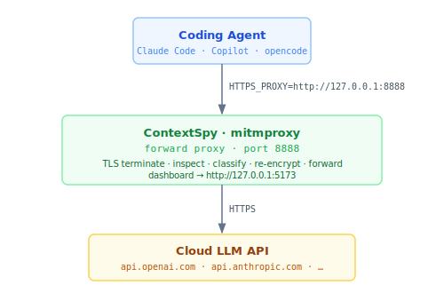

# Cloud API Mode (Forward Proxy)

Use this mode to intercept requests going to **cloud LLM APIs** such as OpenAI,
Anthropic (Claude), GitHub Copilot, or Azure OpenAI.

ContextSpy acts as an HTTPS man-in-the-middle proxy. It terminates TLS, inspects the
request, logs and analyses it, then re-encrypts and forwards it to the provider.



---

## Prerequisites

- ContextSpy installed — see [Installation](install.md)
- CA certificate installed in your OS trust store — see [CA certificate setup](install.md#ca-certificate-setup-cloudforward-proxy-mode-only)

---

## Step 1 — Start ContextSpy

```bash
contextspy start
```

This starts:
- HTTPS forward proxy on **port 8888**
- Web dashboard on **port 5173** (opens automatically in your browser)

Options:
```
--proxy-port  PORT   Proxy listen port (default: 8888)
--web-port    PORT   Dashboard port (default: 5173)
--no-browser         Don't open the browser automatically
```

---

## Step 2 — Configure your agent

There are two options here:
- use a ContextSpy runner - limited to agents you can launch from command line (simpler and preferred) 
- setup environment variables and agent configuration manually

### Using a ContextSpy runner

Launch the agent using the `contextspy run <agent> <path>` command

```bash
contextspy run claude <path to project>        # launches the claude agent, replace placeholder with your project path
contextspy run code ~/code/my-secret-project  # launches vscode with my-secret-project open
contextspy run opencode .                      # launches opencode with the current directory open 
```

This will set up necessary environment variables and launch the agent - it will work with most IDEs and agents that can pick up HTTPS_PROXY environment variable, and route LLM requests through it.

For some node.js based apps (e.g. VS Code), you will need to close all instances of the app before running this command - as if the process is already running, it will not honor proxy settings from the environment variables.

### Manual setup - agent specific

Pick the agent you use and follow the instructions below.
Run `contextspy setup-<agent>` for a printed reminder at any time.

This will set up necessary environment variables


### Manual setup - agent specific

Pick the agent you use and follow the instructions below.
Run `contextspy setup-<agent>` for a printed reminder at any time.

### GitHub Copilot (VS Code)

**Option A — VS Code `settings.json`** (`Ctrl+Shift+P` → "Open User Settings JSON"):

```json
{
  "http.proxy": "http://127.0.0.1:8888",
  "http.proxyStrictSSL": false
}
```

**Option B — environment variables** (set before launching VS Code):

```bash
# macOS / Linux
export HTTPS_PROXY=http://127.0.0.1:8888
export NODE_EXTRA_CA_CERTS=~/.mitmproxy/mitmproxy-ca-cert.pem

# PowerShell
$env:HTTPS_PROXY = "http://127.0.0.1:8888"
$env:NODE_EXTRA_CA_CERTS = "$env:USERPROFILE\.mitmproxy\mitmproxy-ca-cert.pem"
```

```bash
contextspy setup-copilot   # prints the exact snippet
```

### Claude CLI / Claude Code

```bash
# macOS / Linux
export HTTPS_PROXY=http://127.0.0.1:8888
export NODE_EXTRA_CA_CERTS=~/.mitmproxy/mitmproxy-ca-cert.pem

# PowerShell
$env:HTTPS_PROXY = "http://127.0.0.1:8888"
$env:NODE_EXTRA_CA_CERTS = "$env:USERPROFILE\.mitmproxy\mitmproxy-ca-cert.pem"
```

> `NODE_EXTRA_CA_CERTS` is required because Claude CLI is an Electron/Node app with its
> own bundled certificate store that ignores the OS trust store.

```bash
contextspy setup-claude
```

### opencode

```bash
# macOS / Linux
export HTTPS_PROXY=http://127.0.0.1:8888
export SSL_CERT_FILE=~/.mitmproxy/mitmproxy-ca-cert.pem
export NODE_EXTRA_CA_CERTS=~/.mitmproxy/mitmproxy-ca-cert.pem

# PowerShell
$env:HTTPS_PROXY = "http://127.0.0.1:8888"
$env:SSL_CERT_FILE = "$env:USERPROFILE\.mitmproxy\mitmproxy-ca-cert.pem"
$env:NODE_EXTRA_CA_CERTS = "$env:USERPROFILE\.mitmproxy\mitmproxy-ca-cert.pem"
```

> opencode uses both the Go TLS stack (`SSL_CERT_FILE`) and Node.js components
> (`NODE_EXTRA_CA_CERTS`), so both variables are needed.

```bash
contextspy setup-opencode
```

### Python / OpenAI SDK / httpx scripts

```python
import os
os.environ["HTTPS_PROXY"] = "http://127.0.0.1:8888"
```

Or as environment variables:

```bash
# macOS / Linux
HTTPS_PROXY=http://127.0.0.1:8888 python your_script.py

# PowerShell
$env:HTTPS_PROXY = "http://127.0.0.1:8888"
python your_script.py
```

### Cursor

Cursor respects VS Code's proxy settings. Add to your Cursor `settings.json` (`Ctrl+Shift+P` → "Open User Settings JSON"):

```json
{
  "http.proxy": "http://127.0.0.1:8888",
  "http.proxyStrictSSL": false
}
```

### Generic (curl, httpx CLI, etc.)

```bash
# macOS / Linux
export HTTPS_PROXY=http://127.0.0.1:8888
export HTTP_PROXY=http://127.0.0.1:8888

# PowerShell
$env:HTTPS_PROXY = "http://127.0.0.1:8888"
$env:HTTP_PROXY  = "http://127.0.0.1:8888"
```

---

## Step 3 — Use the dashboard

Open http://127.0.0.1:5173. Requests appear in real-time as your agent makes LLM calls.

- **Dashboard** — token usage totals, category breakdown chart, model distribution
- **Requests** — table of all captured requests with token counts and category bars
- **Sessions** — group requests by task; click **Start Session** and give it a name
