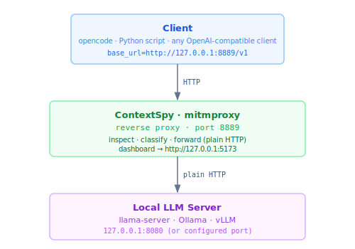

# Local LLM Mode (Reverse Proxy)

Use this mode to intercept requests going to **local LLM servers** such as
[llama.cpp / llama-server](https://github.com/ggerganov/llama.cpp),
[Ollama](https://ollama.com), or [vLLM](https://github.com/vllm-project/vllm).

**Why a different mode?** When client and server are both on `127.0.0.1`, the OS routes
loopback traffic directly and bypasses `HTTPS_PROXY` entirely. A forward proxy cannot
intercept this. Instead, ContextSpy acts as a **reverse proxy**: the client connects to
ContextSpy's listen port, and ContextSpy forwards to the real server. No TLS or
certificate installation needed.



---

## Prerequisites

- ContextSpy installed — see [Installation](install.md)
- A running local LLM server (llama-server, Ollama, or vLLM)
- No CA certificate needed

---

## Step 1 — Configure `~/.contextspy/config.toml`

Add one `[[reverse_targets]]` block per local server you want to intercept. The file is
auto-created at `~/.contextspy/config.toml` on first run.

```toml
# Intercept llama-server on port 8080
[[reverse_targets]]
name        = "llama-server"
listen_port = 8889
target_url  = "http://127.0.0.1:8080"
provider    = "openai"

# Intercept Ollama on port 11434
[[reverse_targets]]
name        = "ollama"
listen_port = 8890
target_url  = "http://127.0.0.1:11434"
provider    = "openai"

# Intercept vLLM on port 8000
[[reverse_targets]]
name        = "vllm"
listen_port = 8891
target_url  = "http://127.0.0.1:8000"
provider    = "openai"
```

| Field | Required | Description |
|---|---|---|
| `name` | yes | Human-readable label shown in the CLI and logs |
| `listen_port` | yes | Port ContextSpy binds on `127.0.0.1` |
| `target_url` | yes | Full base URL of the local LLM server |
| `provider` | yes | Response parser — use `"openai"` for all three servers above |

All three servers implement the OpenAI-compatible `/v1/chat/completions` API.

Run `contextspy setup-llamaserver` (or `-ollama`, `-vllm`) for a ready-to-paste config
snippet.

---

## Step 2 — Start ContextSpy in local mode

```bash
contextspy start-local
```

This starts:
- One reverse-proxy listener per `[[reverse_targets]]` entry
- Web dashboard on **port 5173** (opens automatically)

If `[[reverse_targets]]` is empty or missing, the command prints a config example and
exits.

---

## Step 3 — Point your client at ContextSpy

Instead of connecting to the LLM server directly, use the ContextSpy listen port.

### llama-server (llama.cpp)

Default: llama-server on port 8080, ContextSpy on port 8889.

```python
from openai import OpenAI
client = OpenAI(
    base_url="http://127.0.0.1:8889/v1",   # ContextSpy port
    api_key="not-needed",
)
```

```bash
contextspy setup-llamaserver   # full reminder
```

### Ollama

Default: Ollama on port 11434, ContextSpy on port 8890.

> Ollama ≥ 0.1.24 is required for the `/v1/chat/completions` OpenAI-compatible endpoint.

```python
from openai import OpenAI
client = OpenAI(
    base_url="http://127.0.0.1:8890/v1",
    api_key="ollama",   # Ollama ignores the key
)
```

```bash
contextspy setup-ollama
```

> **Alternative:** If your Ollama client respects `HTTPS_PROXY`, cloud/forward proxy
> mode also works — Ollama's hostname is in the built-in filter list.

### vLLM

Default: vLLM on port 8000, ContextSpy on port 8891.

```python
from openai import OpenAI
client = OpenAI(
    base_url="http://127.0.0.1:8891/v1",
    api_key="not-needed",
)
```

```bash
contextspy setup-vllm
```

---

## Step 4 — Use the dashboard

Open http://127.0.0.1:5173. All captured requests appear in real-time regardless of
which local server they came from. See [cloud mode dashboard](cloud-mode.md#step-3--use-the-dashboard) for details.
